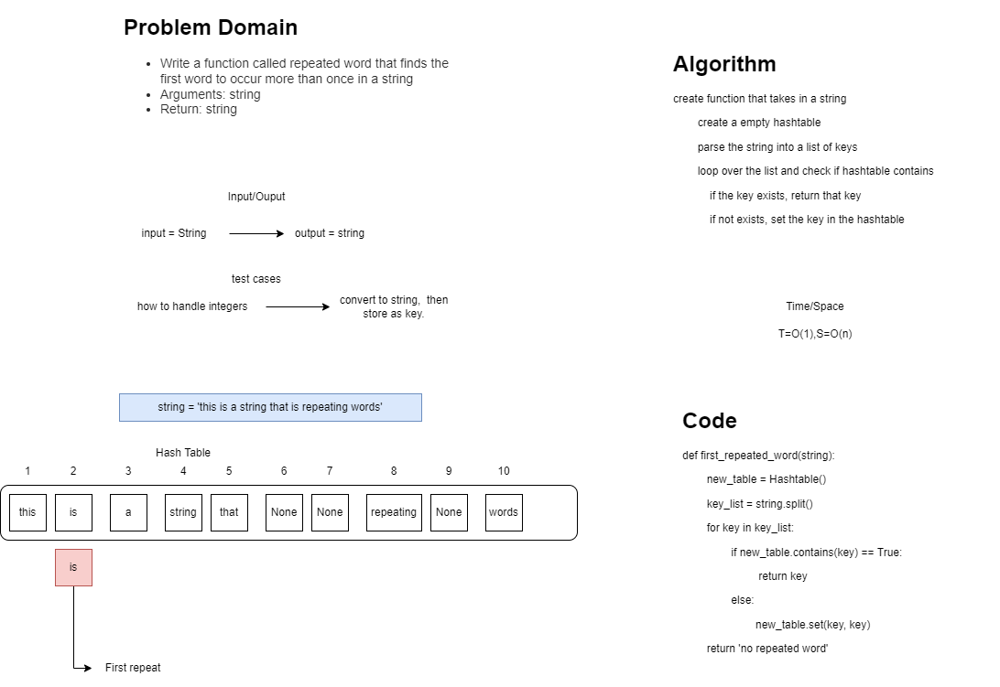

# Challenge Summary
<!-- Description of the challenge -->
Write a function called repeated word that finds the first word to occur more than once in a string
Arguments: string
Return: string
## Links and Resources
<!-- Embedded whiteboard image -->

### Link To Code
<!-- Link to code solution file -->
[Solution](hashtable_repeated_word.py)

### Approach & Efficiency
<!-- What approach did you take? Why? What is the Big O space/time for this approach? -->
- we parsed the string into a list of smaller strings then removed any special characters and then checked them as keys
### Solution
<!-- Show how to run your code, and examples of it in action -->
- running the def first_repeated_word(str) function passing in a string will return what word is repeated

### Tests
<!-- test names and what they test for -->
1. def test_no_repeat():
    - tests for no repeated words
2. test_ignore_case_flipped():
    - tests for case sensitivity
3. test_three
    - tests for....

- Expected failures
1. def test_expected_fail_no_repeat():
    - tests for failed no repeat

2. def test_expected_fail_repeat():
    - tests for failed repeat
