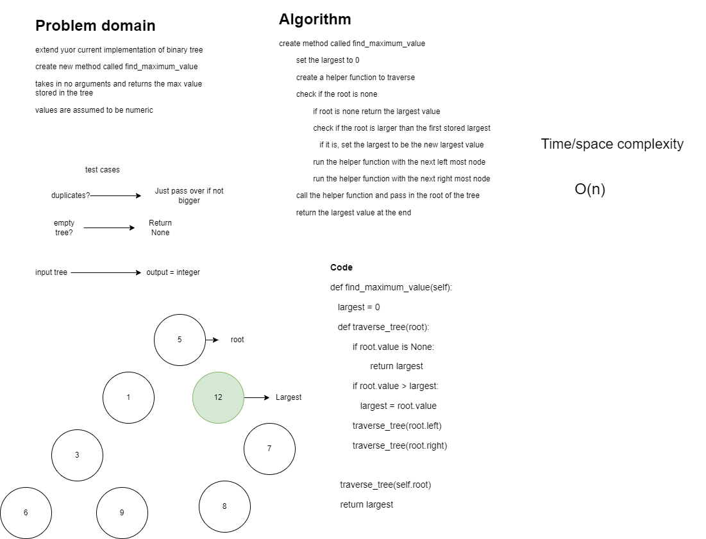

Branch Name: Tree Max

Challenge Type: Maximum value in a binary tree

Features
<ul>
<li>
Write the following method for the Binary Tree class

find maximum value
Arguments: none
Returns: number
</li>
<ul>

## Code
[Binary-tree-max](./binary_tree.py)
## Whiteboard Process
<!-- Embedded whiteboard image -->

## Approach & Efficiency
<!-- What approach did you take? Why? What is the Big O space/time for this approach? -->
The big O is O(n) because we dont know how many nodes are in the tree. The space and time is reflective of the number of nodes
## API
<!-- Description of each method publicly available in each of your trees -->

## Tests
- test if root exists
  - def test_root_node():
- test for max value
  - def test_max_val():
- test max value on a deep tree
  - def test_max_value_deep_tree():
- test if the value returned is greater than
  - def test_value_greater_than():
