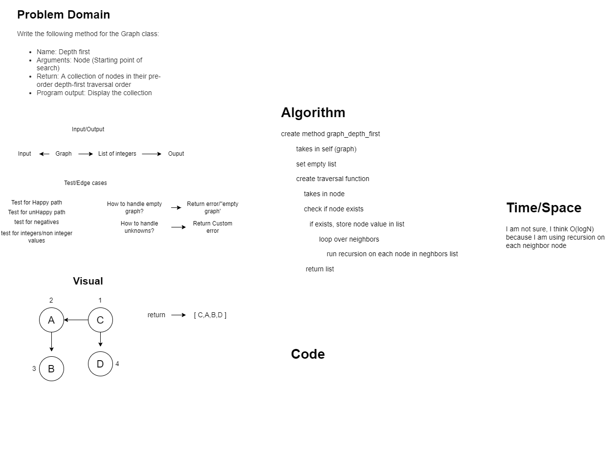

# Challenge Summary
<!-- Description of the challenge -->
Write the following method for the Graph class:

Name: Depth first
Arguments: Node (Starting point of search)
Return: A collection of nodes in their pre-order depth-first traversal order
Program output: Display the collection

## Links and Resources
<!-- Embedded whiteboard image -->

### Link To Code
<!-- Link to code solution file -->
[Solution](./graph_depth_first.py)

### Approach & Efficiency
<!-- What approach did you take? Why? What is the Big O space/time for this approach? -->
- I think o(logN) because i am calling recursion on each node inside of the nieghbors list

### Solution
<!-- Show how to run your code, and examples of it in action -->

### Tests
<!-- test names and what they test for -->
1. test_one()
    - tests for....
2. test_two()
    - tests for....
3. test_three
    - tests for....
