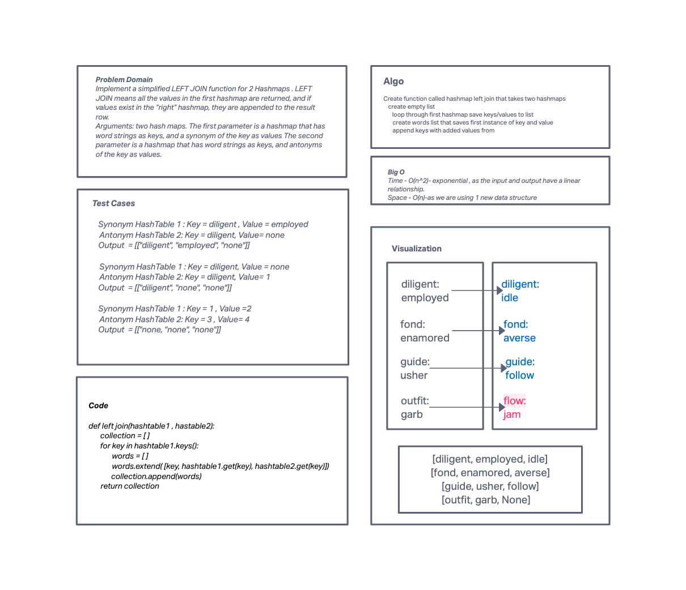

# Challenge Summary
<!-- Description of the challenge -->

- Write a function called left join
- Arguments: two hash maps
- The first parameter is a hashmap that has word strings as keys, and a synonym of the key as values.
- The second parameter is a hashmap that has word strings as keys, and antonyms of the key as values.
- Return: The returned data structure that holds the results is up to you. It doesn’t need to exactly match the output below, so long as it achieves the LEFT JOIN logic

## Links and Resources
<!-- Embedded whiteboard image -->

### Link To Code
<!-- Link to code solution file -->
[Solution](hashtable_left_join.py)

### Approach & Efficiency
<!-- What approach did you take? Why? What is the Big O space/time for this approach? -->
Time/Space
- O(n)

### Solution
<!-- Show how to run your code, and examples of it in action -->

### Tests
<!-- test names and what they test for -->
1. test_one()
    - tests for....
2. test_two()
    - tests for....
3. test_three
    - tests for....
