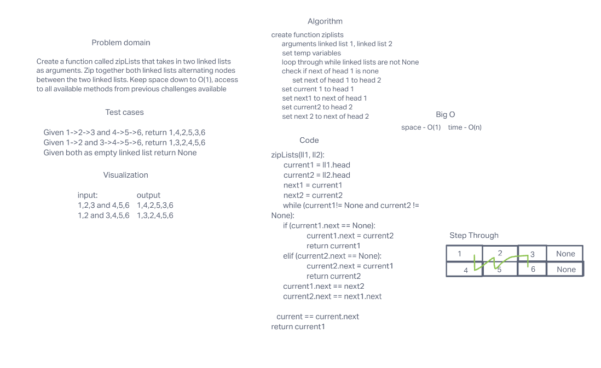

# Challenge Summary
<!-- Description of the challenge -->
## ZipList
### Feature Tasks Code Challenge Class 08
**Create a function that takes in two linked Lists and returns a zipped list**

- Write a function called zip lists
- Arguments: 2 linked lists
- Return: New Linked List, zipped as noted below
- Zip the two linked lists together into one so that the nodes alternate between the two lists and return a reference to the the zipped list.
- Try and keep additional space down to O(1)
- You have access to the Node class and all the properties on the Linked List class as well as the methods created in previous challenges.

## Whiteboard Process
<!-- Embedded whiteboard image -->

## Code
[ZipList](./linked_list_zip.py)

## Approach & Efficiency
<!-- What approach did you take? Why? What is the Big O space/time for this approach? -->

> zipList - Time = O(n), Space = O(1)

## Solution
<!-- Show how to run your code, and examples of it in action -->

## Unit Tests

- check if there is no linked lists
- check if only one linked list
- check if only 1 item in linked list
