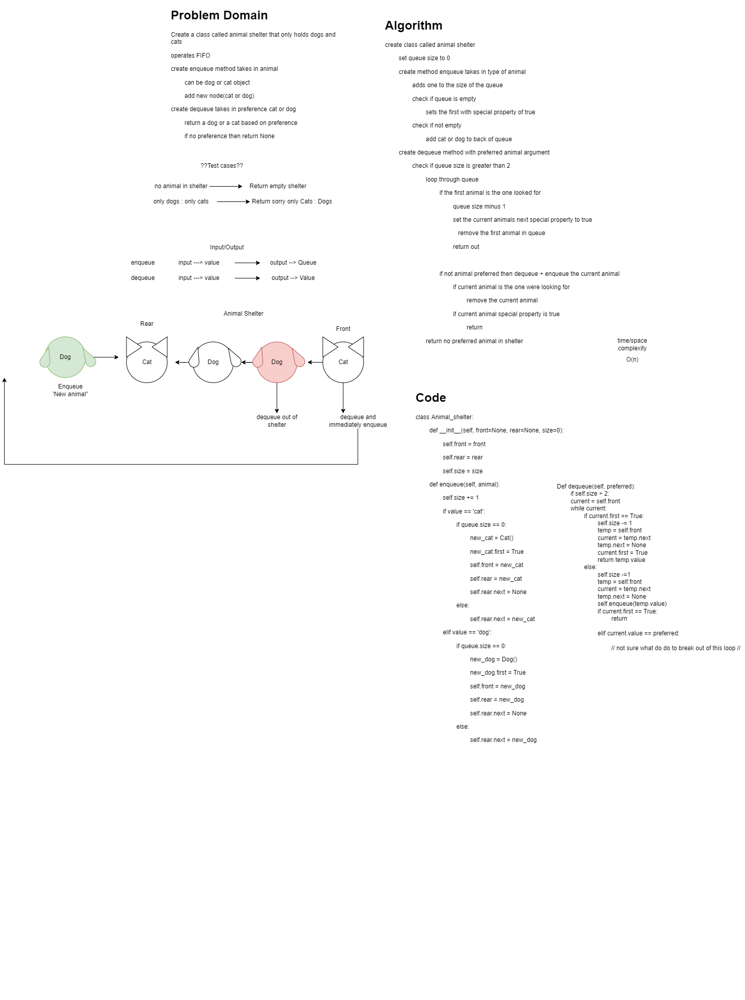

# Challenge Summary
<!-- Description of the challenge -->
## Stack Queue Animal Shelter
### Feature Tasks Code Challenge Class 12
****

## Whiteboard Process
<!-- Embedded whiteboard image -->

## Code
[animal_shelter](./stack_queue_animal_shelter.py)

## Approach & Efficiency
<!-- What approach did you take? Why? What is the Big O space/time for this approach? -->

> animal shelter - Time = O(n), Space = O(n)
>   0 of N because I am using 1 while loop on one queue and modifying queue in place

## Solution
<!-- Show how to run your code, and examples of it in action -->

## Unit Tests
