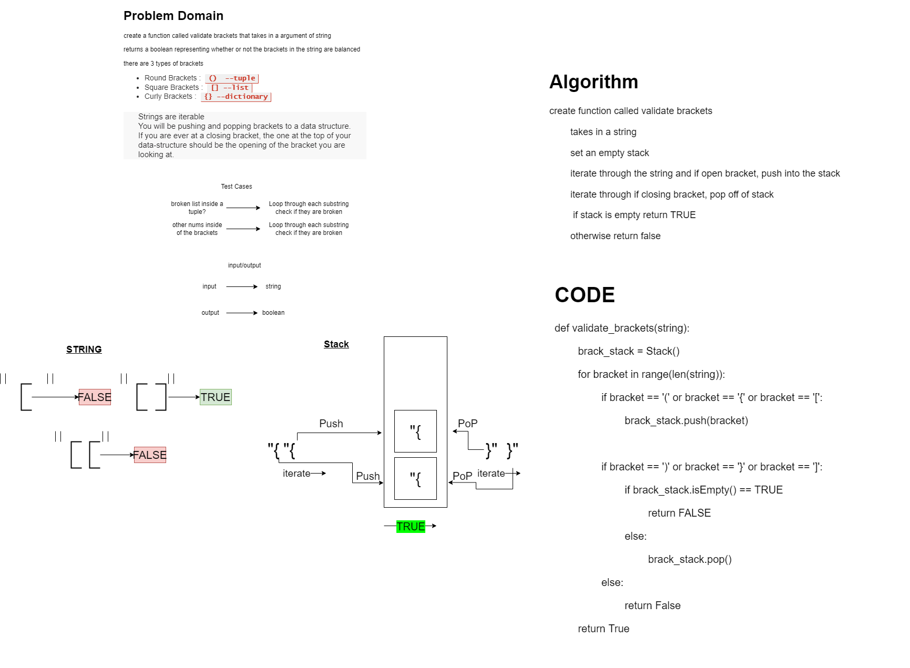

# Challenge Summary
<!-- Description of the challenge -->
## Stack Queue Animal Shelter
### Feature Tasks Code Challenge Class 13
****

## Whiteboard Process
<!-- Embedded whiteboard image -->

## Code
[animal_shelter](./stack_queue_brackets.py)

## Approach & Efficiency
<!-- What approach did you take? Why? What is the Big O space/time for this approach? -->

> stack queue brackets - Time = O(n), Space = O(n)
>   0 of N because I am using 1 for loop, however, the stack requires a loop as well

## Solution
<!-- Show how to run your code, and examples of it in action -->

## Unit Tests
