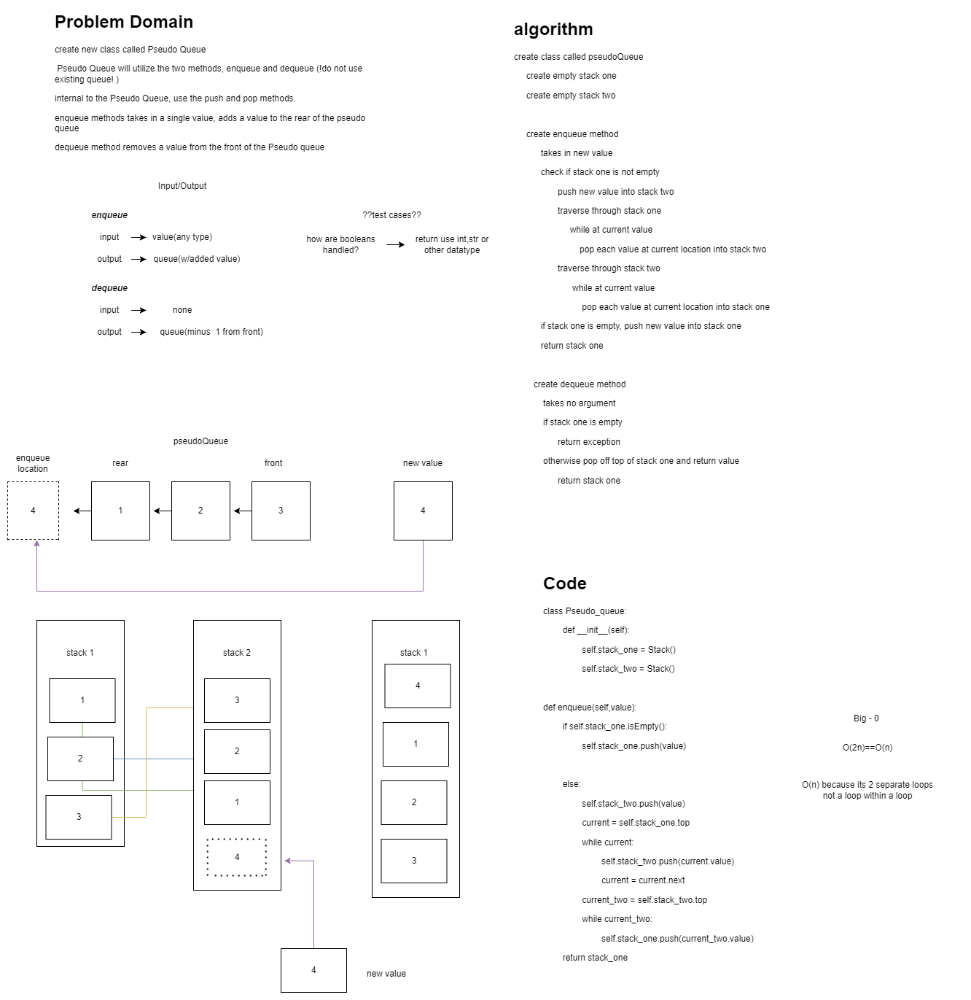

# Challenge Summary
<!-- Description of the challenge -->
## Pseudo Queue
### Feature Tasks Code Challenge Class 11
**Implement a Queue using two Stacks.**

- Create a new class called pseudo queue.
   - Do not use an existing Queue.
   - Instead, this PseudoQueue class will implement our standard queue interface (the two methods listed below),
   - Internally, utilize 2 Stack instances to create and manage the queue
   Methods:
       - enqueue
         - Arguments: value
         - Inserts value into the PseudoQueue, using a first-in, first-out approach.
       - dequeue
         - Arguments: none
         - Extracts a value from the PseudoQueue, using a first-in, first-out approach.

## Whiteboard Process
<!-- Embedded whiteboard image -->

## Code
[PseudoQueue](./stack_queue_pseudo.py)

## Approach & Efficiency
<!-- What approach did you take? Why? What is the Big O space/time for this approach? -->

> psuedoQueue - Time = O(n), Space = O(n)
>   0 of 2N because I am using 2 while loops outside each other so they are not nested

## Solution
<!-- Show how to run your code, and examples of it in action -->

## Unit Tests

- def test_enqueue_one():
- def test_enqueue_two():
- def test_enqueue_dequeue_enqueue_dequeue():
