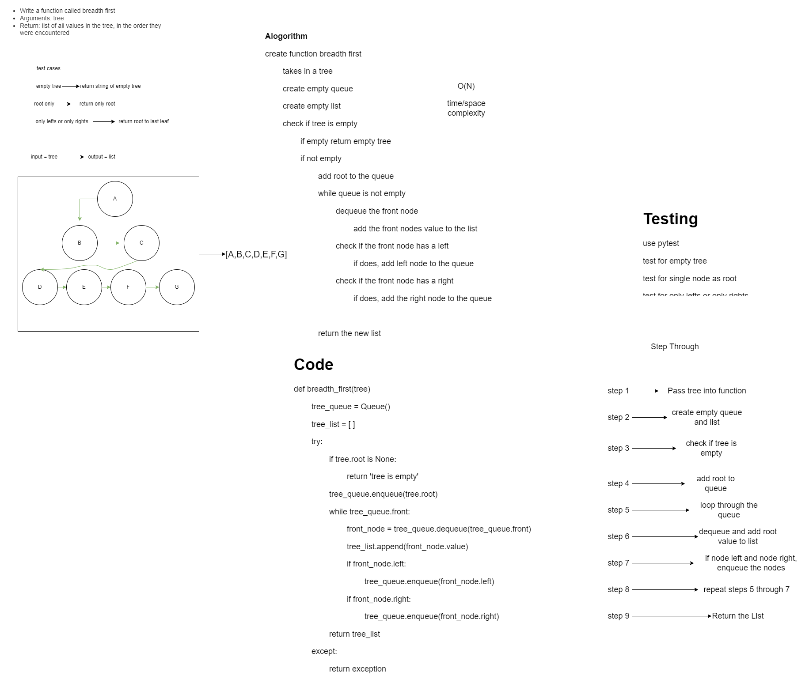

# Challenge Summary
<!-- Description of the challenge -->
## Tree Breadth First
### Feature Tasks Code Challenge Class 17
**Write a function called breadth first**

- Write a function called breadth first
- Arguments: tree
- Return: list of all values in the tree, in the order they were encountered

## Whiteboard Process
<!-- Embedded whiteboard image -->

## Code
[Tree Breadth First](./tree_breadth_first.py)

## Approach & Efficiency
<!-- What approach did you take? Why? What is the Big O space/time for this approach? -->

> Breadth first - Time = O(n), Space = O(N)

## Solution
<!-- Show how to run your code, and examples of it in action -->

## Unit Tests

- check if Tree is empty
- Check if only root node
- check if only lefts or only rights