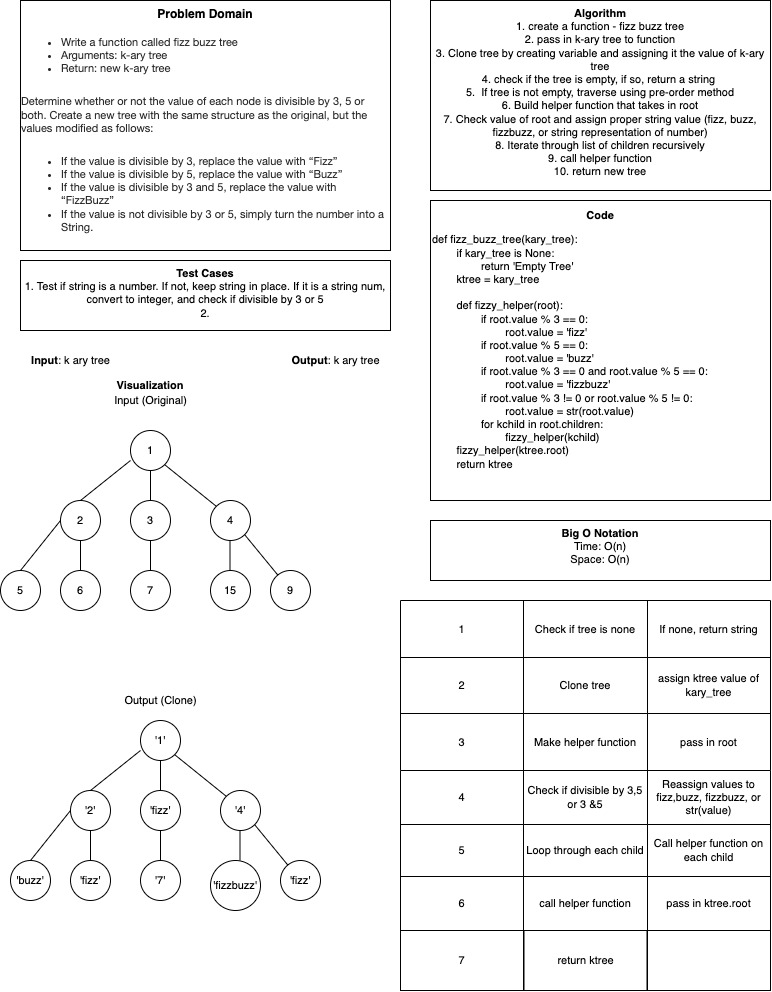

# Challenge Summary
<!-- Description of the challenge -->
Write a function called fizz buzz tree
- Arguments: k-ary tree
- Return: new k-ary tree
- Determine whether or not the value of each node is divisible by 3, 5 or both. Create a new tree with the same structure as the original, but the values modified as follows:

- If the value is divisible by 3, replace the value with “Fizz”
- If the value is divisible by 5, replace the value with “Buzz”
- If the value is divisible by 3 and 5, replace the value with “FizzBuzz”
- If the value is not divisible by 3 or 5, simply turn the number into a String.

## Links and Resources
<!-- Embedded whiteboard image -->

### Link To Code
<!-- Link to code solution file -->
[Solution](./tree_fizz_buzz.py)

### Approach & Efficiency
<!-- What approach did you take? Why? What is the Big O space/time for this approach? -->
**Space/Time**
- O(n)
- making a new clone not modifying original clone

### Solution
<!-- Show how to run your code, and examples of it in action -->

### Tests
<!-- test names and what they test for -->
1. test_exists()
    - tests for test working
2. test_one_to_15_fizzy_clone(tree)
    - tests for returned fizz buzz string tree
    - all nodes are a string and all nodes have proper reassigned values
3. test_new_copy_returned(tree)
    - tests for original tree values
    - **I don't think this test works properly, as the problem domain asks to return a new tree with the modified values and this test checks if the tree is still in its original state.**
