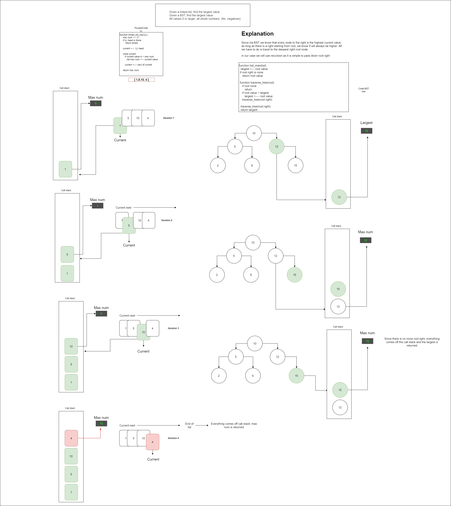

# Blog Notes: Linked List BST Max

# Challenge Summary
<!-- Description of the challenge -->
- Given a linked-list, find the largest value.
- Given a BST, find the largest value
- All values 0 or larger, all whole numbers. (No -negatives).

## Links and Resources
<!-- Embedded whiteboard image -->

### Link To Code
<!-- Link to code solution file -->
[Solution](insertion_sort.py)

### Approach & Efficiency
<!-- What approach did you take? Why? What is the Big O space/time for this approach? -->
Time Complexity: Not sure but it only has to go through the list or BST once so I would assume O(1)
Space Complexity: O(N)

### Solution
<!-- Show how to run your code, and examples of it in action -->
- Runs through the list of BST and updates the current max value

### Tests
<!-- test names and what they test for -->
No tests per roger
