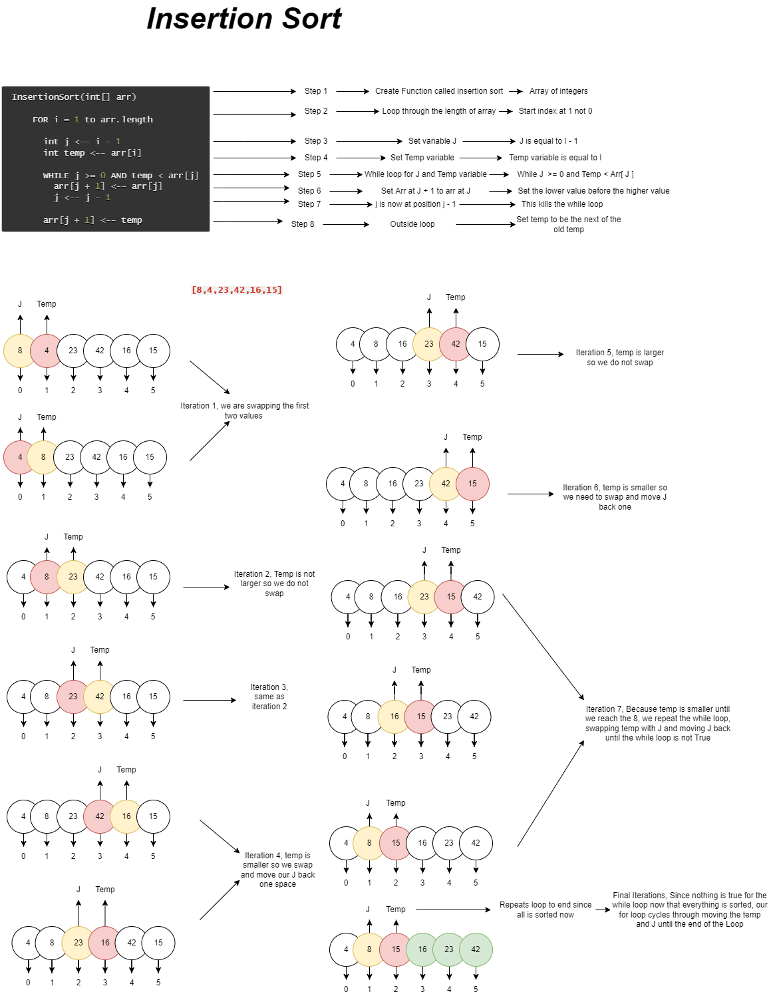

# Blog Notes: Insertion Sort

# Challenge Summary
<!-- Description of the challenge -->
Create a Blog that Walks through insertion sort

## Links and Resources
<!-- Embedded whiteboard image -->

### Link To Code
<!-- Link to code solution file -->
[Solution](insertion_sort.py)

### Approach & Efficiency
<!-- What approach did you take? Why? What is the Big O space/time for this approach? -->
Time Complexity: O(N2)
Space Complexity: O(1)

### Solution
<!-- Show how to run your code, and examples of it in action -->
- each loop iteration swaps the temp if it is smaller and changes where the temp and the first index location is each time.

### Tests
<!-- test names and what they test for -->
1. def test_insertion_sort_initial():
    - tests for initial sorting
2. def test_insertion_sort_reversed():
    - tests for Reversed array
3. def test_insertion_sort_sorta_sorted():
    - tests for array partially sorted
4. def test_insertion_sort_dupes():
    - tests for array that has duplicates
