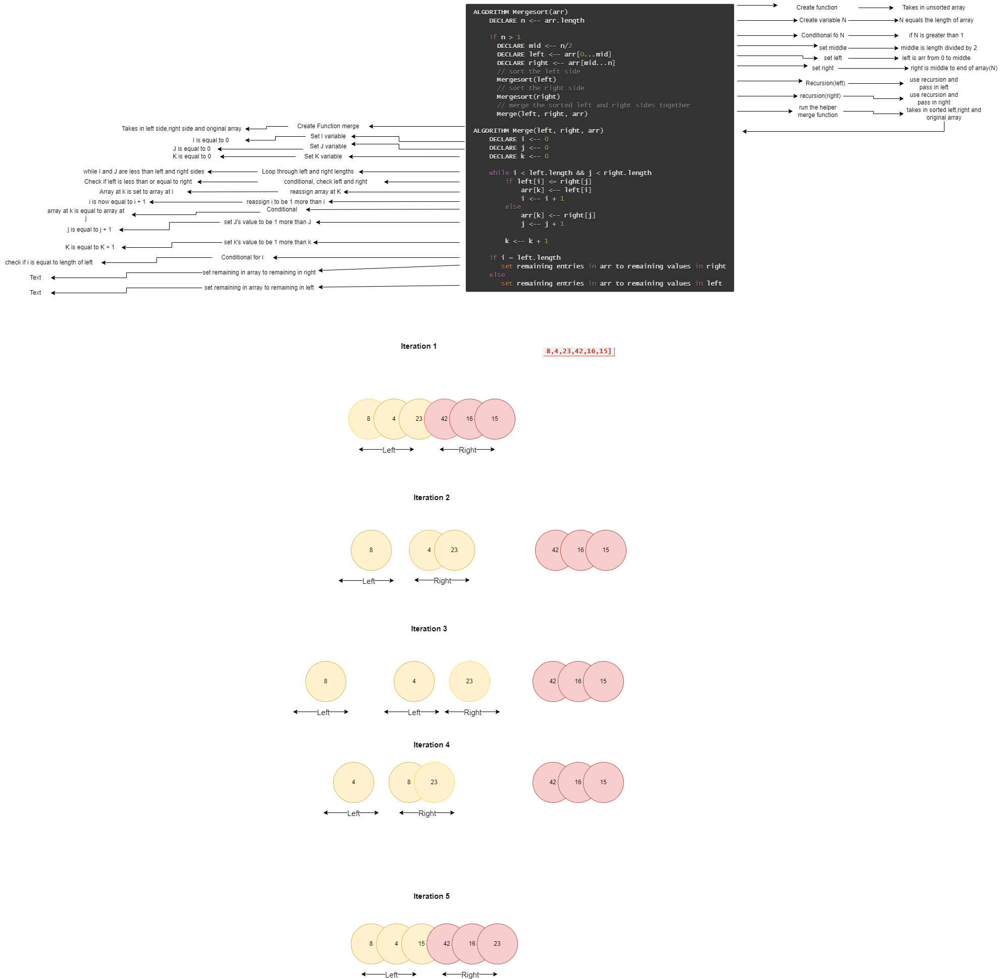
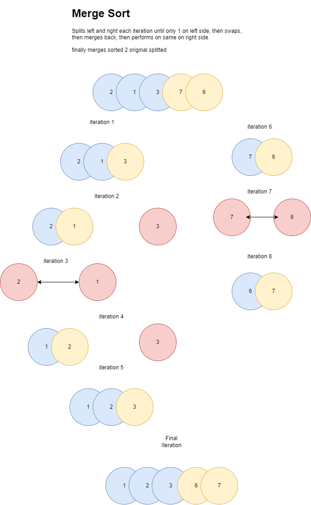

# Blog Notes: Merge Sort

# Challenge Summary
<!-- Description of the challenge -->
Create a Blog that Walks through Merge sort

## Links and Resources
<!-- Embedded whiteboard image -->

### Link To Code
<!-- Link to code solution file -->
[Solution](merge_sort.py)

### Approach & Efficiency
<!-- What approach did you take? Why? What is the Big O space/time for this approach? -->
Time Complexity:
Space Complexity:

### Solution
<!-- Show how to run your code, and examples of it in action -->
-

### Tests
<!-- test names and what they test for -->
1. test one:
    - 
2. test two:
    -
3. test three:
    - 
4. test four:
    - 

